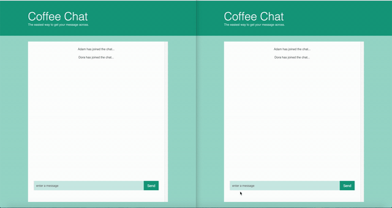

# [Coffee Chat](https://coffee-chat.netlify.com/)

Coffee Chat is a chat application built with Socket.io, HTML5, CSS3, and JavaScript. Features used are Flexbox, CSS Variables, ES6 Arrow Functions, ES6 Map, Let and Const variables, Node.js, Express.js, and Socket.io.

- [Deployed front-end](https://coffee-chat.netlify.com/)

## Short demo:

## Tech Stack

- Socket.io
- HTML5
- CSS3
- JavaScript
